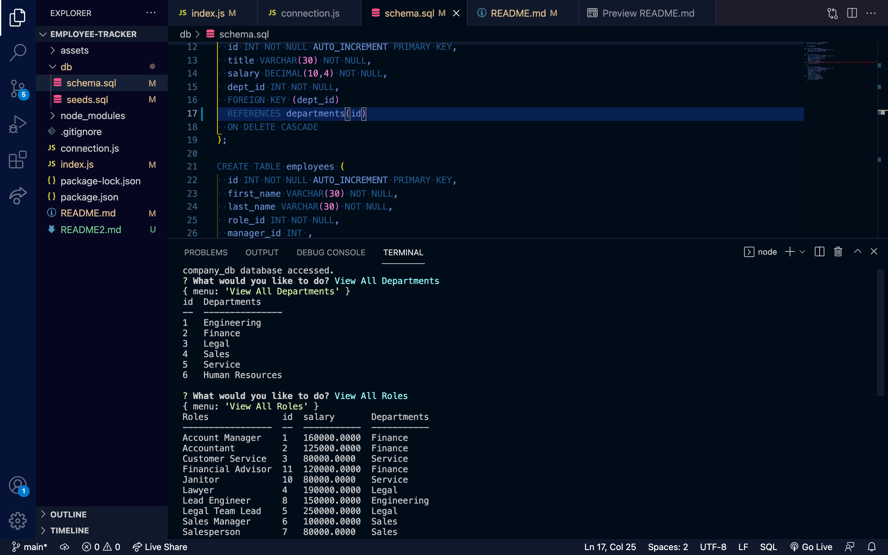

# Employee Tracker
  
## Description: 
This application creates an easily accessible database to keep track of employees in a given company; noting thier roles, salaries,and departments. 
## Table of Contents

* [Installation](#installation)
* [Usage](#usage)
* [Contribution](#contribution)

* [Test](#test)
* [Questions](#questions)

## Installation 
The following dependencies need to be installed to run the application properly:Node.js,express,mysql2, and inquirer

## Usage: 
when launched the server will prompt the user for what information they would like presented to them. after selecting from the available choices the information will be displayed for them in Node. For further help please refer to the image below and accompanying video.

image:
 

## Contribution
Contributors:n/a

## Test:
please review the installation instructions.

## Questions: 
For any additional questions or issues you encounter; please contact me via email at Jerome.mcclarin@gmail.com or visit my GitHub at [JeromeMcC](https://github.com/JeromeMcC/).
